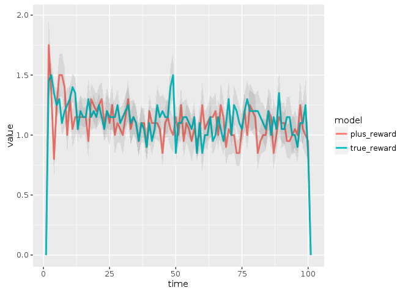
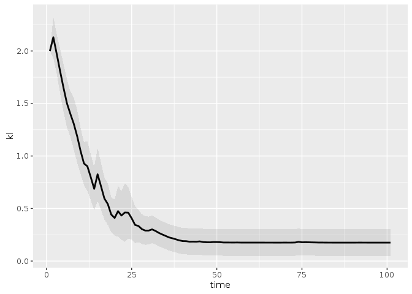

POMDP Planning and Learning in Uncertain Systems
================
Carl Boettiger and Milad Memarzadeh

[](https://drone.carlboettiger.info/boettiger-lab/pomdpplus)

<!-- README.md is generated from README.Rmd. Please edit that file -->
``` r
library("pomdpplus")
library("ggplot2")
library("tidyr")
library("dplyr")
#> 
#> Attaching package: 'dplyr'
#> The following objects are masked from 'package:stats':
#> 
#>     filter, lag
#> The following objects are masked from 'package:base':
#> 
#>     intersect, setdiff, setequal, union
library("seewave")
```

Initialize a simple POMDP model for fisheries:

``` r
states <- 0:10
reward_fn <-  function(x, a) pmin(x, a)
sigma_g = 0.28
sigma_m = 0.28

## Create a list of models with these parameters
p <- expand.grid(K = c(4,8), r = c(1/2, 1))

models <- apply(p, 1, function(row) 
  function(x, h){
     s <- pmax(x - h, 0)
     s * exp(row[["r"]] * (1 - s / row[["K"]]) )
  })
    

matrices <- lapply(models, function(model) 
  appl::fisheries_matrices(states = states, actions = states, 
                           observed_states = states, reward_fn = reward_fn,
                           f = model, sigma_g = sigma_g, sigma_m = sigma_m))

T <- lapply(matrices, `[[`, "transition")
O <- lapply(matrices, `[[`, "observation")
reward <- matrices[[1]][["reward"]] # same for all models
```

``` r
## In addition to the matrices, to define the POMDP problem we need a discount factor for future rewards
discount = 0.95

## PLUS parameters
t = 100       # We'll simulate 100 steps into the future using these modesl
Num_sim = 20  # We will use 20 replicate simulations
n_true = 3    # We specify model 3 as the "true model"
n_sample = 2  # As the number of models could be large, we will sub-sample for efficiency


## We use uniform priors for the initial belief over states and over models
initial = array(1, dim = length(states)) / length(states)
P = (array(1,dim = length(models))/ length(models))
```

Run PLUS:

``` r
plus_results <- plus(list(T, O, reward, discount), t, Num_sim, n_true, n_sample, initial, P, precision = 1)
```

``` r
## extract results to separate objects for convenience
df <- plus_results[["df"]]
posterior <- plus_results[["posterior"]]
```

Have we converged to the correct model?

``` r
tail(posterior)
#>      time sim      model_1      model_2 model_3      model_4
#> 2015   96  20 5.270647e-20 9.448129e-10       1 1.700537e-15
#> 2016   97  20 1.918135e-20 2.007738e-09       1 1.585180e-14
#> 2017   98  20 1.754314e-20 1.223916e-09       1 2.933854e-15
#> 2018   99  20 2.850714e-20 1.227464e-09       1 4.518328e-16
#> 2019  100  20 1.354016e-20 8.365657e-10       1 3.574407e-16
#> 2020  101  20 8.487830e-21 6.622317e-10       1 2.219400e-16
```

The data.frame `df` returns information about the simulations for both the true and learned `plus` models, allowing us to compare them. Here we compare the rewards garnered from the true and `plus` model over time, summarizing across the replicate simulations.

``` r
df %>% 
  select(time, sim, true_reward, plus_reward) %>%
  gather(model, value, -time, -sim) %>%
  ggplot(aes(time, value, group = model)) + 
    stat_summary(aes(color = model), geom="line", fun.y = mean, lwd = 1) +
    stat_summary(geom="ribbon", fun.data = mean_se, alpha = 0.1)
#> Warning: failed to assign NativeSymbolInfo for env since env is already
#> defined in the 'lazyeval' namespace
```



We can also compute the KL diveregnce to show the rate of learning:

``` r
# delta function for true model distribution
h_star = array(0,dim = length(models)) 
h_star[n_true] = 1

## Fn for the base-2 KL divergence from true model, in a friendly format
kl2 <- function(value) seewave::kl.dist(value, h_star, base = 2)[[2]]

## Compute KL over models
P <- posterior %>% 
  gather(model, value, -time, -sim) %>%
  group_by(time, sim) %>% 
  summarise(kl = kl2(value))

## plot mean/se of KL over replicates
ggplot(P, aes(time, kl)) + 
    stat_summary(geom="line", fun.y = mean, lwd = 1) +
    stat_summary(geom="ribbon", fun.data = mean_se, alpha = 0.1)
```


