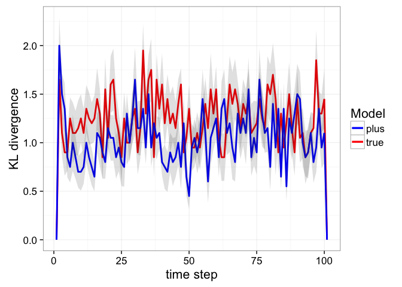

POMDP Planning and Learning in Uncertain Systems
================
Carl Boettiger and Milad Memarzadeh

[](https://drone.carlboettiger.info/boettiger-lab/pomdpplus)

<!-- README.md is generated from README.Rmd. Please edit that file -->
``` r
library("pomdpplus")
```

Initialize a simple POMDP model for fisheries:

``` r
states <- 0:10
actions <- states
reward_fn <- function(x,h) pmin(x,h)
discount <- 0.95

sigma_g <- sqrt(log(1 + 0.5 / 6))
sigma_m <- sigma_g
f <- function(x, h, r = 1, K = 20){
  s <- pmax(x - h, 0)
  s * exp(r * (1 - s / K) )
}

kk = c(4,8); rr = c(0.5,1)
Num_model = length(kk) * length(rr)
T = vector("list", length = Num_model)
O = vector("list", length = Num_model)
n_s <- length(states)
n_a <- length(actions)
observed_states <- states
n_z <- length(observed_states)

observation <- array(0, dim = c(n_s, n_z, n_a))
for (k in 1:n_a) {
  if(sigma_m <= 0){
    observation[, , k] <- diag(n_s)
  } else {
    for (i in 1:n_s) {
      if(states[i] <= 0){ ## cannot do dlnorm with mu = log(0) = -Inf.  Cannot solve if belief has already converged
        x <- dlnorm(observed_states, -1, sigma_m)
        observation[i, , k] <- x / sum(x)
      } else {
        x <- dlnorm(observed_states, log(states[i]), sdlog = sigma_m)    # transition probability densities
        ## Normalize using CDF
        N <- plnorm(observed_states[n_s], log(states[i]), sigma_m)       # CDF accounts for prob density beyond boundary
        x <- x * N / sum(x)                                   # normalize densities to  = cdf(boundary)
        x[n_s] <- 1 - N + x[n_s]                              # pile remaining probability on boundary
        observation[i, , k] <- x                             # store as row of transition matrix
      }
    }
  }
}

kkk = 1
for(l in 1:length(kk)){
  for(j in 1:length(rr)){
    transition <- array(0, dim = c(n_s, n_s, n_a))
    for (k in 1:n_s) {
      for (i in 1:n_a) {
        nextpop <- f(states[k], actions[i],rr[j],kk[l])
        if(nextpop <= 0)
          transition[k, , i] <- c(1, rep(0, n_s - 1))
        else if(sigma_g > 0){
          x <- dlnorm(states, log(nextpop), sdlog = sigma_g)    # transition probability densities
          N <- plnorm(states[n_s], log(nextpop), sigma_g)       # CDF accounts for prob density beyond boundary
          x <- x * N / sum(x)                                   # normalize densities to  = cdf(boundary)
          x[n_s] <- 1 - N + x[n_s]                              # pile remaining probability on boundary
          transition[k, , i] <- x                             # store as row of transition matrix
        } else {
          stop("sigma_g not > 0")
        }
      }
    }
    T[[kkk]] = transition; O[[kkk]] = observation
    kkk = kkk+1
  }
}


reward <- array(0, dim = c(n_s, n_a))
for (k in 1:n_s) {
  for (i in 1:n_a) {
    reward[k, i] <- reward_fn(states[k], actions[i])
  }
}

t = 100
Num_sim = 20
n_true = 3 
n_sample = 2 
initial = array(1, dim = n_s) / n_s
P = (array(1,dim = length(T))/ length(T))
```

Run PLUS:

``` r
plus_results <- plus(list(T, O, reward, discount),t, Num_sim, n_true, n_sample, initial, P,precision = 1)
```

``` r
df <- plus_results[[1]]
posterior <- plus_results[[2]]
library("ggplot2")
library("tidyr")
library("dplyr")
#> 
#> Attaching package: 'dplyr'
#> The following objects are masked from 'package:stats':
#> 
#>     filter, lag
#> The following objects are masked from 'package:base':
#> 
#>     intersect, setdiff, setequal, union
library("seewave")
```

Here, we are computing the KL between the posterior over the models and the true model to visualize the efficiency of learning

``` r
post = array(0,dim = c(t+1,Num_model,Num_sim))
for(i in 1:Num_sim){
  post[,1,i] = posterior$model_1[posterior$sim==i]
  post[,2,i] = posterior$model_2[posterior$sim==i]
  post[,3,i] = posterior$model_3[posterior$sim==i]
  post[,4,i] = posterior$model_4[posterior$sim==i]
}
KL = array(0, dim = c(t+1,Num_sim))
h_star = array(0,dim = Num_model); h_star[n_true] = 1
for(i in 1:(t+1)){
  for(j in 1:Num_sim){
    out <- kl.dist(post[i,,j],h_star,base = 2)
    KL[i,j] = out[[2]]
  }
}
KL_mean = apply(t(KL), 2,mean)
KL_sd = apply(t(KL), 2, sd) / sqrt(Num_sim)
eb <- aes(x = unique(posterior$time), ymax = KL_mean + KL_sd, ymin = KL_mean - KL_sd, linetype = NA)
ggplot() + 
  geom_line(aes(x = unique(posterior$time), y = KL_mean), size = 1.0) +
  geom_ribbon(eb,alpha = 0.15) + xlab("time step") + ylab("KL divergence") + theme_bw(base_size = 16)
```


Here we visualize the sequence of immediate rewards

``` r
r_true = array(0,dim = c(t+1,Num_sim))
r_plus = array(0,dim = c(t+1,Num_sim))

for(i in 1:Num_sim){
  r_true[,i] = df$true_reward[df$sim==i]
  r_plus[,i] = df$plus_reward[df$sim==i]
}
r_true_mean = apply(t(r_true), 2,mean)
r_true_sd = apply(t(r_true), 2, sd) / sqrt(Num_sim)
r_plus_mean = apply(t(r_plus), 2,mean)
r_plus_sd = apply(t(r_plus), 2, sd) / sqrt(Num_sim)
eb_true <- aes(x = unique(df$time), ymax = r_true_mean + r_true_sd, ymin = r_true_mean - r_true_sd, linetype = NA)
eb_plus <- aes(x = unique(df$time), ymax = r_plus_mean + r_plus_sd, ymin = r_plus_mean - r_plus_sd, linetype = NA)
ggplot() + 
  geom_line(aes(x = unique(df$time), y = r_true_mean, col = "true"), size = 1.0) +
  geom_line(aes(x = unique(df$time), y = r_plus_mean, col = "plus"), size = 1.0) +
  geom_ribbon(eb_true,alpha = 0.15) + geom_ribbon(eb_plus,alpha = 0.15) +
  scale_colour_manual(name = "Model", values=alpha(c("blue","red"),1)) +
  xlab("time step") + ylab("KL divergence") + theme_bw(base_size = 16)
```


