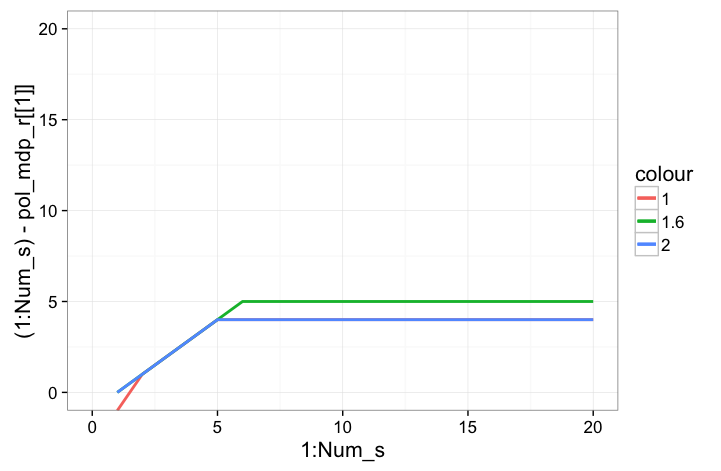
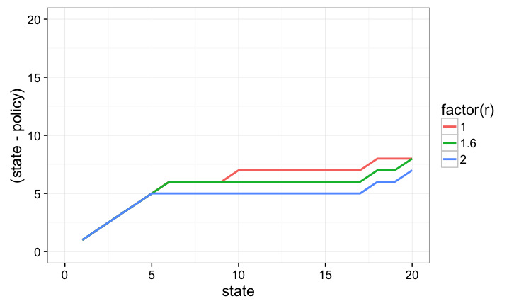
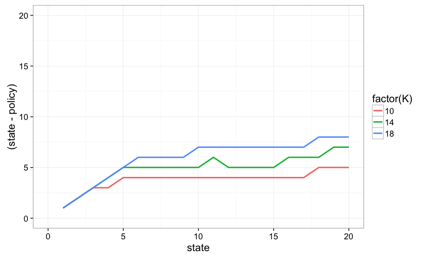
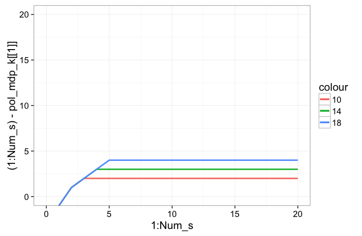
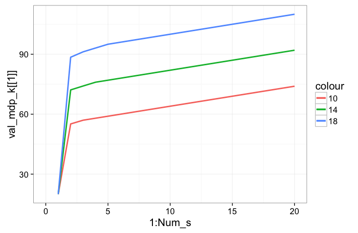
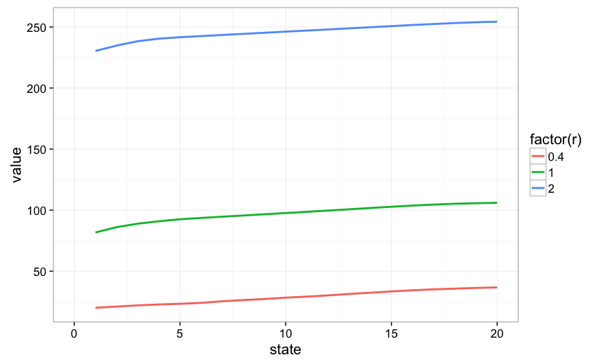
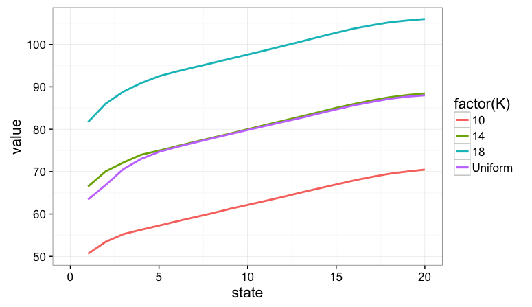
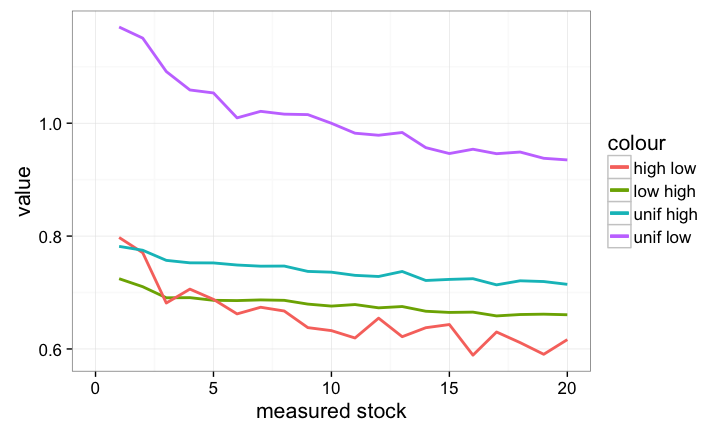
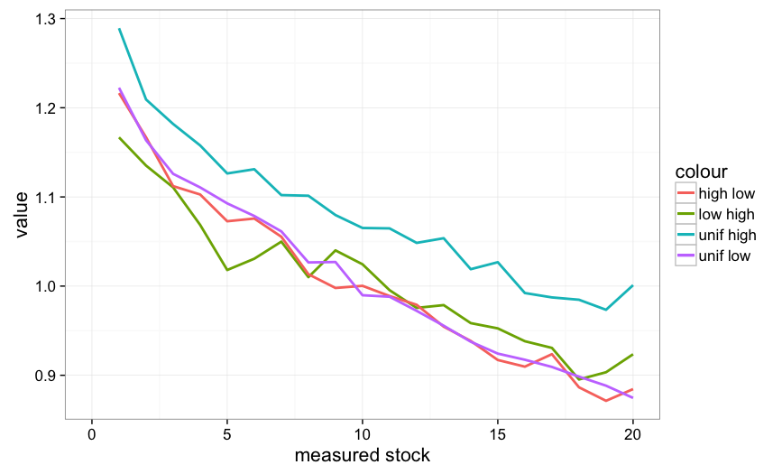

# parameter-uncertainty-POMDP
Milad Memarzadeh
7/25/2016  

Num_s = 20; sigma_g = 0.2, sigma_m = 0.2; Num_a = 21; Num_z = 20

r \in {0.4,1,2}, K = 18

K \in {10,14,18}, r = 1

## Policy

### MDP

### POMDP

## Value

### MDP

### POMDP

## relative Values

### r

### K

