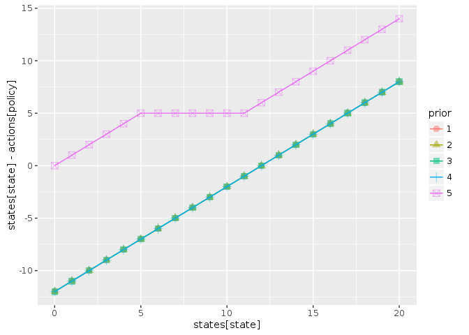
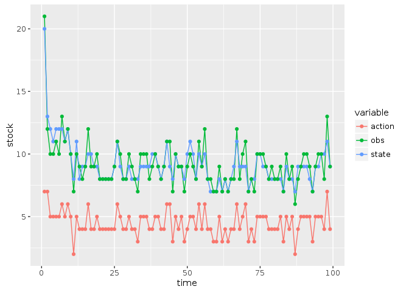
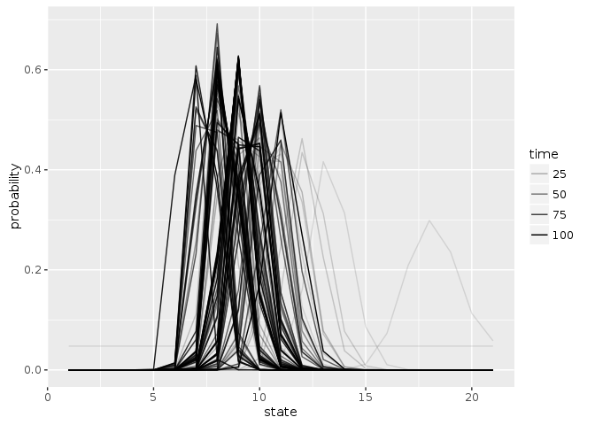
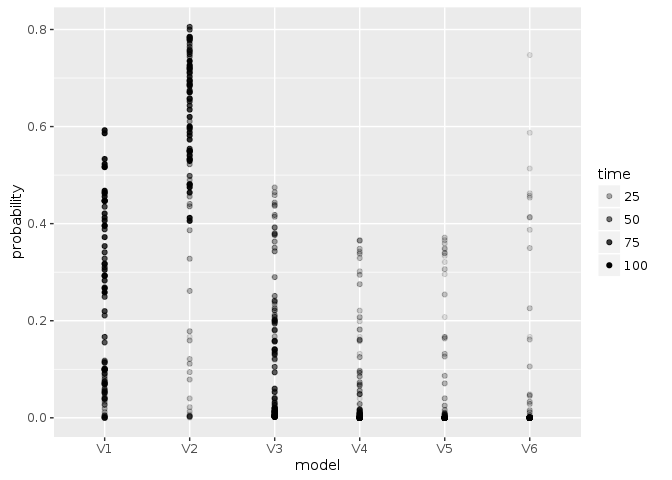

```r
library("appl")
library("pomdpplus")
library("ggplot2")
library("tidyr")
library("dplyr")
```

```
## 
## Attaching package: 'dplyr'
```

```
## The following objects are masked from 'package:stats':
## 
##     filter, lag
```

```
## The following objects are masked from 'package:base':
## 
##     intersect, setdiff, setequal, union
```

```r
knitr::opts_chunk$set(cache = TRUE)
```


```r
log_dir <- "https://raw.githubusercontent.com/cboettig/pomdp-solutions-library/master/library"
meta <- appl::meta_from_log(data.frame(model ="ricker", r = 1, K = c(10:15)), log_dir)
meta <- meta[1:6,]
meta
```

```
##                                     id load_time_sec init_time_sec
## 1 37d7035d-5f30-4388-a238-d3e04b1550e2          0.03          0.17
## 2 b5ae04f7-3034-42b3-934e-a8f15d6638a7          0.03          0.15
## 3 6339c033-0ac9-4518-a359-5162181d8d83          0.02          0.23
## 4 f954c9a7-4d28-4fa2-918f-5f25ec40071d          0.03          0.18
## 5 8b33c306-c6b7-4555-9757-962cef3805e9          0.03          0.21
## 6 cfb42d60-2fa1-4325-aa18-3a908313714b          0.07          0.22
##   run_time_sec final_precision              end_condition n_states n_obs
## 1         2.16       0.0994059   target precision reached       21    21
## 2       229.92       0.0998444   target precision reached       21    21
## 3       255.40       0.0963830   target precision reached       21    21
## 4       872.98       0.0984824   target precision reached       21    21
## 5      1129.91       0.0996549   target precision reached       21    21
## 6      4835.77       0.0999046   target precision reached       21    21
##   n_actions discount                date  model r  K  C sigma_g sigma_m
## 1        21     0.95 2016-08-29 21:29:47 ricker 1 10 NA     0.1     0.1
## 2        21     0.95 2016-08-29 21:33:38 ricker 1 11 NA     0.1     0.1
## 3        21     0.95 2016-08-29 21:52:49 ricker 1 12 NA     0.1     0.1
## 4        21     0.95 2016-08-29 22:07:24 ricker 1 13 NA     0.1     0.1
## 5        21     0.95 2016-08-29 22:26:16 ricker 1 14 NA     0.1     0.1
## 6        21     0.95 2016-08-29 23:46:57 ricker 1 15 NA     0.1     0.1
##   memory
## 1   3844
## 2   3844
## 3   3844
## 4   3844
## 5   3844
## 6   3844
```


## Import parameters from log


```r
setup <- meta[1,]

states <- 0:(setup$n_states - 1)
actions <- states
obs <- states

sigma_g <- setup$sigma_g
sigma_m <- setup$sigma_m

reward_fn <- function(x,h) pmin(x,h)
discount <- setup$discount 

models <- models_from_log(meta, reward_fn)
alphas <- alphas_from_log(meta, log_dir)
```


Policy based on a uniform prior belief over the models:  


```r
# K = 10:40
A <- compute_plus_policy(alphas, models, model_prior  = c(1,0,0,0))
B <- compute_plus_policy(alphas, models, model_prior  = c(0,1,0,0))
C <- compute_plus_policy(alphas, models, model_prior = c(0,0,1,0))
D <- compute_plus_policy(alphas, models, model_prior = c(0,0,0,1))
unif <- compute_plus_policy(alphas, models)

df <- dplyr::bind_rows(A, B, C, D, unif, .id = "prior")

ggplot(df, aes(states[state], states[state] - actions[policy], col = prior, pch = prior)) + 
  geom_point(alpha = 0.5, size = 3) + 
  geom_line()
```

<!-- -->


```r
set.seed(123)
out <- sim_plus(models = models, discount = discount,
                x0 = 20, a0 = 1, Tmax = 100, 
                true_model = models[[2]], 
                alphas = alphas)


out$df %>% 
  dplyr::select(-value) %>% 
  tidyr::gather(variable, stock, -time) %>% 
  ggplot(aes(time, stock, color = variable)) + geom_line()  + geom_point()
```

<!-- -->

Evolution of the belief state:


```r
Tmax <-length(out$state_posterior[,1])
out$state_posterior %>% data.frame(time = 1:Tmax) %>% 
  tidyr::gather(state, probability, -time, factor_key =TRUE) %>% 
  dplyr::mutate(state = as.numeric(state)) %>% 
  ggplot(aes(state, probability, group = time, alpha = time)) + geom_line()
```

<!-- -->


```r
out$model_posterior %>% data.frame(time = 1:Tmax) %>% 
  tidyr::gather(model, probability, -time, factor_key =TRUE) %>% 
  ggplot(aes(model, probability, group = time, alpha = time)) + geom_point()
```

<!-- -->

