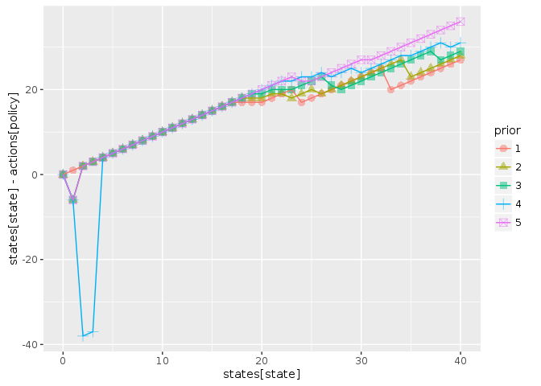
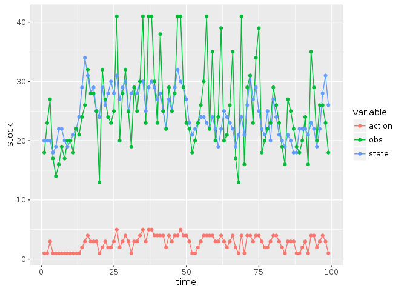
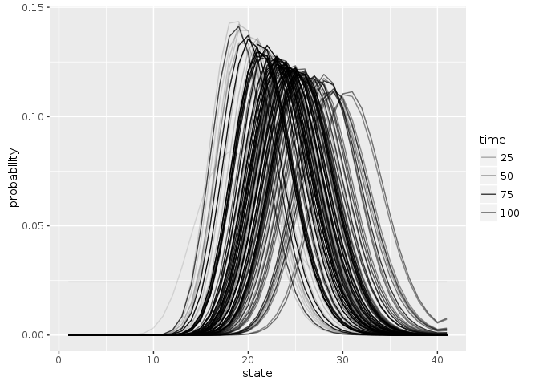
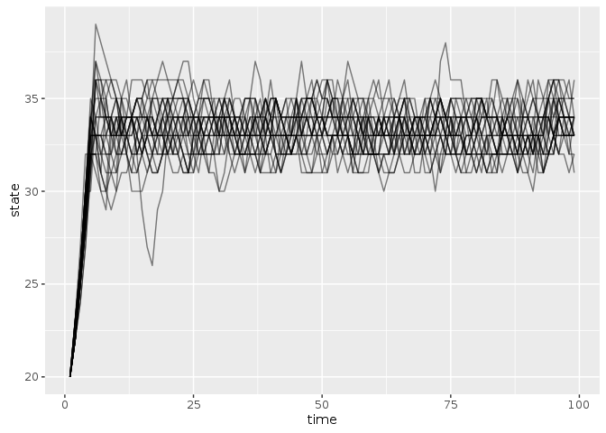

```r
library("appl")
library("pomdpplus")
library("ggplot2")
library("tidyr")
library("purrr")
library("dplyr")
```

```
## 
## Attaching package: 'dplyr'
```

```
## The following objects are masked from 'package:purrr':
## 
##     contains, order_by
```

```
## The following objects are masked from 'package:stats':
## 
##     filter, lag
```

```
## The following objects are masked from 'package:base':
## 
##     intersect, setdiff, setequal, union
```

```r
knitr::opts_chunk$set(cache = TRUE)
```


```r
log_dir <- "https://raw.githubusercontent.com/cboettig/pomdp-solutions-library/master/archive"
meta <- appl::meta_from_log(data.frame(model = "allen", r = 1, K = 40, sigma_m = 0.05), log_dir) ## two sets, differ only in sigma_m
meta
```

```
##                                      id load_time_sec init_time_sec
## 58 69e848c9-4110-443d-8dad-f2be96b2d7e0          0.56         29.54
## 59 fa567e2f-73d5-4fdf-ab6d-5d5a4cb7a0bf          0.53         27.38
## 60 09e37ff6-a2b1-4083-bfd3-39e80c161fcd          0.56         26.23
## 61 2e7512dc-d8a5-46e3-a426-869df2a1f0ae          0.55         24.73
##    run_time_sec final_precision end_condition n_states n_obs n_actions
## 58      1692.22        1.390330          <NA>       51    51        51
## 59      2884.55        1.206410          <NA>       51    51        51
## 60      1974.26        1.017950          <NA>       51    51        51
## 61      2724.39        0.869657          <NA>       51    51        51
##    discount                date model r  K  C sigma_g sigma_m
## 58     0.99 2016-08-19 17:39:04 allen 1 40  0    0.02    0.05
## 59     0.99 2016-08-19 18:27:51 allen 1 40  5    0.02    0.05
## 60     0.99 2016-08-19 19:01:25 allen 1 40 10    0.02    0.05
## 61     0.99 2016-08-19 19:47:28 allen 1 40 15    0.02    0.05
```


## Import parameters from log


```r
setup <- meta[1,]

states <- 0:(setup$n_states - 1)
actions <- states
obs <- states

sigma_g <- setup$sigma_g
sigma_m <- setup$sigma_m

reward_fn <- function(x,h) pmin(x,h)
discount <- setup$discount 

models <- models_from_log(meta, reward_fn)
alphas <- alphas_from_log(meta, log_dir)
```


Policy based on a uniform prior belief over the models:  


```r
C0 <- compute_plus_policy(alphas, models, model_prior  = c(1,0,0,0))
C5 <- compute_plus_policy(alphas, models, model_prior  = c(0,1,0,0))
C10 <- compute_plus_policy(alphas, models, model_prior = c(0,0,1,0))
C15 <- compute_plus_policy(alphas, models, model_prior = c(0,0,0,1))
unif <- compute_plus_policy(alphas, models)

df <- dplyr::bind_rows(C0, C5, C10, C15, unif, .id = "prior")

ggplot(df, aes(states[state], states[state] - actions[policy], col = prior, pch = prior)) + 
  geom_point(alpha = 0.5, size = 3) + 
  geom_line()
```

<!-- -->


```r
set.seed(123)
out <- sim_plus(models = models, discount = discount,
                x0 = 20, a0 = 1, Tmax = 100, 
                true_model = models[[3]], 
                alphas = alphas)


out$df %>% 
  dplyr::select(-value) %>% 
  tidyr::gather(variable, stock, -time) %>% 
  ggplot(aes(time, stock, color = variable)) + geom_line()  + geom_point()
```

<!-- -->

Evolution of the belief state:


```r
Tmax <-length(out$state_posterior[,1])
out$state_posterior %>% data.frame(time = 1:Tmax) %>% 
  tidyr::gather(state, probability, -time, factor_key =TRUE) %>% 
  dplyr::mutate(state = as.numeric(state)) %>% 
  ggplot(aes(state, probability, group = time, alpha = time)) + geom_line()
```

<!-- -->


```r
out$model_posterior %>% data.frame(time = 1:Tmax) %>% 
  tidyr::gather(model, probability, -time, factor_key =TRUE) %>% 
  ggplot(aes(model, probability, group = time, alpha = time)) + geom_point()
```

<!-- -->


Replicates: 


```r
sims <- 
purrr::map_df(1:25, 
       function(i) sim_plus(models = models, discount = discount,
                x0 = 20, a0 = 1, Tmax = 100, 
                true_model = models[[3]], 
                alphas = alphas)$df,
  .id = "rep")
```


```r
sims %>% 
  ggplot(aes(time, state, group = rep)) + geom_line(alpha = 0.5)
```

<!-- -->

