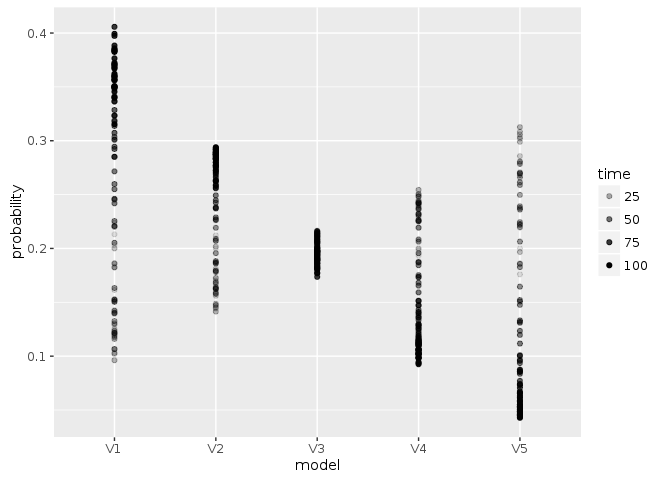
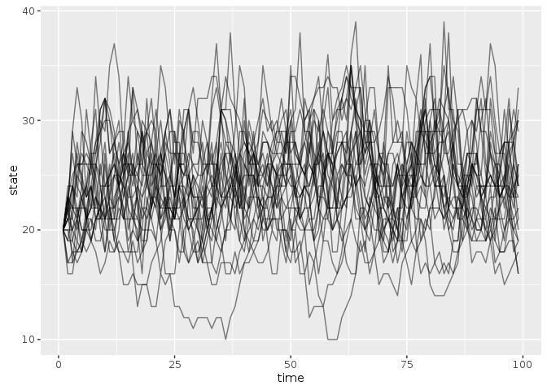

```r
library("appl")
library("pomdpplus")
library("ggplot2")
library("tidyr")
library("purrr")
library("dplyr")
```

```
## 
## Attaching package: 'dplyr'
```

```
## The following objects are masked from 'package:purrr':
## 
##     contains, order_by
```

```
## The following objects are masked from 'package:stats':
## 
##     filter, lag
```

```
## The following objects are masked from 'package:base':
## 
##     intersect, setdiff, setequal, union
```

```r
knitr::opts_chunk$set(cache = TRUE)
```


```r
#log_dir <- "https://raw.githubusercontent.com/cboettig/pomdp-solutions-library/master/archive"
#meta <- appl::meta_from_log(data.frame(model = "allen", r = 1, K = 40, sigma_m = 0.05), log_dir) ## two sets, differ only in sigma_m

## larger noise example
log_dir <- "https://raw.githubusercontent.com/cboettig/pomdp-solutions-library/master/archive"
meta <- appl::meta_from_log(data.frame(model = "allen", r = 0.5, K = 40), log_dir) ## two sets, differ only in sigma_m

meta 
```

```
##                                      id load_time_sec init_time_sec
## 21 d55a94f7-976e-449b-a709-5661b825d58e          0.83         43.74
## 22 fb950517-8099-48c3-8de1-752bfb67ab70          0.82         41.82
## 23 8cbf90de-828e-43f7-88db-975e5cf2d7af          0.84         45.12
## 24 1c0e6f9d-c010-4c48-a182-2bfc60fe1474          0.83         45.11
## 25 56e21d94-c766-4214-bd47-1880130f1670          0.82         40.20
## 26 d55a94f7-976e-449b-a709-5661b825d58e          0.83         43.74
## 27 fb950517-8099-48c3-8de1-752bfb67ab70          0.82         41.82
## 28 8cbf90de-828e-43f7-88db-975e5cf2d7af          0.84         45.12
## 29 1c0e6f9d-c010-4c48-a182-2bfc60fe1474          0.83         45.11
## 30 56e21d94-c766-4214-bd47-1880130f1670          0.82         40.20
## 31 cf361735-e68d-4ac3-bdf8-96043b80e188          0.86         44.54
## 32 a450e8d1-e475-4c35-bc0f-8498aafded87          0.86         43.10
## 33 d3dde8e9-9747-43f6-a0f6-2f3b8f2915b0          0.86         45.18
## 34 8a1aee12-c67f-40c7-b3b1-2bd9e4b127f9          0.87         47.28
## 35 7333b999-72be-4c01-97cb-719d0cce0b76          0.87         39.36
##    run_time_sec final_precision end_condition n_states n_obs n_actions
## 21      1187.87        15.00200          <NA>       61    61        61
## 22      1227.89        26.79250          <NA>       61    61        61
## 23      1277.08        24.27580          <NA>       61    61        61
## 24      1156.81        10.34910          <NA>       61    61        61
## 25      1384.45         4.21038          <NA>       61    61        61
## 26      1187.87        15.00200          <NA>       61    61        61
## 27      1227.89        26.79250          <NA>       61    61        61
## 28      1277.08        24.27580          <NA>       61    61        61
## 29      1156.81        10.34910          <NA>       61    61        61
## 30      1384.45         4.21038          <NA>       61    61        61
## 31      1236.06        15.00200          <NA>       61    61        61
## 32      1252.64        26.79250          <NA>       61    61        61
## 33      1334.65        24.27580          <NA>       61    61        61
## 34      1252.32        10.34910          <NA>       61    61        61
## 35      1469.01         4.21038          <NA>       61    61        61
##    discount                date model   r  K  C   sigma_g   sigma_m
## 21     0.99 2016-08-15 04:47:41 allen 0.5 40  0 0.1285663 0.1285663
## 22     0.99 2016-08-15 05:09:03 allen 0.5 40  5 0.1285663 0.1285663
## 23     0.99 2016-08-15 05:31:15 allen 0.5 40 10 0.1285663 0.1285663
## 24     0.99 2016-08-15 05:51:25 allen 0.5 40 15 0.1285663 0.1285663
## 25     0.99 2016-08-15 06:15:25 allen 0.5 40 20 0.1285663 0.1285663
## 26     0.99 2016-08-15 04:47:41 allen 0.5 40  0 0.1285663 0.1285663
## 27     0.99 2016-08-15 05:09:03 allen 0.5 40  5 0.1285663 0.1285663
## 28     0.99 2016-08-15 05:31:15 allen 0.5 40 10 0.1285663 0.1285663
## 29     0.99 2016-08-15 05:51:25 allen 0.5 40 15 0.1285663 0.1285663
## 30     0.99 2016-08-15 06:15:25 allen 0.5 40 20 0.1285663 0.1285663
## 31     0.99 2016-08-15 07:14:31 allen 0.5 40  0 0.1285663 0.1285663
## 32     0.99 2016-08-15 07:36:37 allen 0.5 40  5 0.1285663 0.1285663
## 33     0.99 2016-08-15 07:59:51 allen 0.5 40 10 0.1285663 0.1285663
## 34     0.99 2016-08-15 08:21:42 allen 0.5 40 15 0.1285663 0.1285663
## 35     0.99 2016-08-15 08:47:16 allen 0.5 40 20 0.1285663 0.1285663
```

```r
meta <- meta[1:5,]
```


## Import parameters from log


```r
setup <- meta[1,]

states <- 0:(setup$n_states - 1)
actions <- states
obs <- states

sigma_g <- setup$sigma_g
sigma_m <- setup$sigma_m

reward_fn <- function(x,h) pmin(x,h)
discount <- setup$discount 

models <- models_from_log(meta, reward_fn)
alphas <- alphas_from_log(meta, log_dir)
```


Policy based on a uniform prior belief over the models:  


```r
C0 <- compute_plus_policy(alphas, models, model_prior  = c(1,0,0,0,0))
C5 <- compute_plus_policy(alphas, models, model_prior  = c(0,1,0,0,0))
C10 <- compute_plus_policy(alphas, models, model_prior = c(0,0,1,0,0))
C15 <- compute_plus_policy(alphas, models, model_prior = c(0,0,0,1,0))
C20 <- compute_plus_policy(alphas, models, model_prior = c(0,0,0,0,1))
unif <- compute_plus_policy(alphas, models)

df <- dplyr::bind_rows(C0, C5, C10, C15, unif, .id = "prior")

ggplot(df, aes(states[state], states[state] - actions[policy], col = prior, pch = prior)) + 
  geom_point(alpha = 0.5, size = 3) + 
  geom_line()
```

<!-- -->


```r
set.seed(123)
out <- sim_plus(models = models, discount = discount,
                x0 = 20, a0 = 1, Tmax = 100, 
                true_model = models[[3]], 
                alphas = alphas)


out$df %>% 
  dplyr::select(-value) %>% 
  tidyr::gather(variable, stock, -time) %>% 
  ggplot(aes(time, stock, color = variable)) + geom_line()  + geom_point()
```

<!-- -->

Evolution of the belief state:


```r
Tmax <-length(out$state_posterior[,1])
out$state_posterior %>% data.frame(time = 1:Tmax) %>% 
  tidyr::gather(state, probability, -time, factor_key =TRUE) %>% 
  dplyr::mutate(state = as.numeric(state)) %>% 
  ggplot(aes(state, probability, group = time, alpha = time)) + geom_line()
```

<!-- -->


```r
out$model_posterior %>% data.frame(time = 1:Tmax) %>% 
  tidyr::gather(model, probability, -time, factor_key =TRUE) %>% 
  ggplot(aes(model, probability, group = time, alpha = time)) + geom_point()
```

<!-- -->


Replicates: 


```r
sims <- 
purrr::map_df(1:25, 
       function(i) sim_plus(models = models, discount = discount,
                x0 = 20, a0 = 1, Tmax = 100, 
                true_model = models[[3]], 
                alphas = alphas)$df,
  .id = "rep")
```


```r
sims %>% 
  ggplot(aes(time, state, group = rep)) + geom_line(alpha = 0.5)
```

<!-- -->

