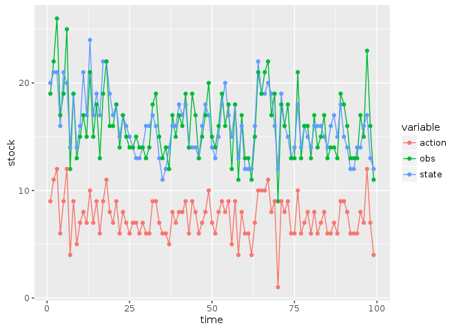

```r
library("MDPtoolbox")
```

```
## Loading required package: Matrix
```

```
## Loading required package: linprog
```

```
## Loading required package: lpSolve
```

```r
library("appl")
library("ggplot2")
library("dplyr")
```

```
## 
## Attaching package: 'dplyr'
```

```
## The following objects are masked from 'package:stats':
## 
##     filter, lag
```

```
## The following objects are masked from 'package:base':
## 
##     intersect, setdiff, setequal, union
```

```r
knitr::opts_chunk$set(cache = TRUE)
```


```r
source("pomdp_learning.R")
```


## Problem definition


```r
states <- 0:20
actions <- states
obs <- states

sigma_g <- sqrt(log(1 + 0.1 / 6)) # Scale the log-standard-deviation to result in similar variance to a uniform distribution of width 0.5
sigma_m <- sigma_g

reward_fn <- function(x,h) pmin(x,h)
discount <- 0.95


Ks <-  seq(5, 20, length.out = 10)
K_models <- lapply(Ks, function(K) 
  function(x, h){
     r <- 1
     s <- pmax(x - h, 0)
     s * exp(r * (1 - s / K) )
  })

models <- lapply(K_models, function(model) 
    appl::fisheries_matrices(states = states, actions = actions, 
                             observed_states = states, reward_fn = reward_fn,
                             f = model, sigma_g = sigma_g, sigma_m = sigma_m))


model_prior = rep(1, length(models)) / length(models)
```


```r
m1 <- fisheries_matrices(states, actions, obs, reward_fn, K_models[[2]], sigma_g, sigma_m)
m2 <- fisheries_matrices(states, actions, obs, reward_fn, K_models[[9]], sigma_g, sigma_m)
```


## POMDP solution, model 1


```r
soln_1 <- pomdp_solve(m1$transition, m1$observation, m1$reward, discount, precision = 1)
```

```
## load time: 0.06 sec, init time: 0.09 sec, run time: 0.12 sec, final precision: 0.949057 end_condition:   target precision reached
```

```r
soln_2 <- pomdp_solve(m2$transition, m2$observation, m2$reward, discount, precision = 1)
```

```
## load time: 0.07 sec, init time: 0.2 sec, run time: 2.64 sec, final precision: 0.988588 end_condition:   target precision reached
```


## Planning solution


```r
soln <- pomdp_planning(models, discount, model_prior, verbose = TRUE, mc.cores = 1L, precision = 1)
```

```
## load time: 0.06 sec, init time: 0.07 sec, run time: 0.08 sec, final precision: 0.877313 end_condition:   target precision reached
```

```
## load time: 0.07 sec, init time: 0.08 sec, run time: 0.12 sec, final precision: 0.949057 end_condition:   target precision reached
```

```
## load time: 0.06 sec, init time: 0.08 sec, run time: 0.15 sec, final precision: 0.919978 end_condition:   target precision reached
```

```
## load time: 0.06 sec, init time: 0.11 sec, run time: 0.21 sec, final precision: 0.954564 end_condition:   target precision reached
```

```
## load time: 0.07 sec, init time: 0.13 sec, run time: 0.31 sec, final precision: 0.985769 end_condition:   target precision reached
```

```
## load time: 0.06 sec, init time: 0.12 sec, run time: 0.52 sec, final precision: 0.973586 end_condition:   target precision reached
```

```
## load time: 0.07 sec, init time: 0.13 sec, run time: 0.92 sec, final precision: 0.942936 end_condition:   target precision reached
```

```
## load time: 0.06 sec, init time: 0.14 sec, run time: 1.43 sec, final precision: 0.989347 end_condition:   target precision reached
```

```
## load time: 0.07 sec, init time: 0.15 sec, run time: 2.47 sec, final precision: 0.988588 end_condition:   target precision reached
```

```
## load time: 0.07 sec, init time: 0.15 sec, run time: 1.65 sec, final precision: 0.983279 end_condition:   target precision reached
```


```r
df <- 
  rbind(data.frame(model = "m1", soln_1),
      data.frame(model = "m2", soln_2),
      data.frame(model = "unif", soln))

ggplot(df, aes(states[state], states[state] - actions[policy], col = model, pch = model)) + 
  geom_point(alpha = 0.5, size = 3) + 
  geom_line() + 
  ylim(0,15)
```

```
## Warning: Removed 5 rows containing missing values (geom_point).
```

```
## Warning: Removed 5 rows containing missing values (geom_path).
```

<!-- -->

