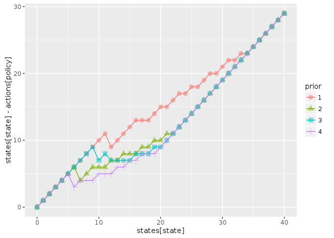
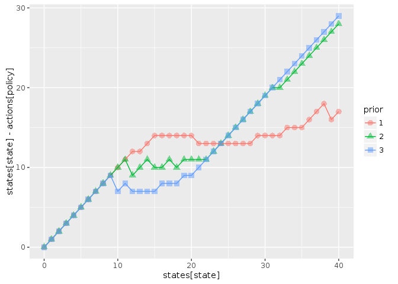
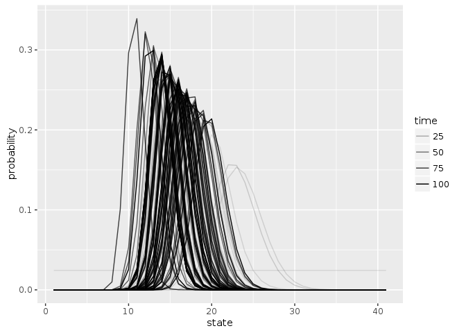

```r
library("appl")
library("pomdpplus")
library("ggplot2")
library("tidyr")
library("dplyr")
```

```
## 
## Attaching package: 'dplyr'
```

```
## The following objects are masked from 'package:stats':
## 
##     filter, lag
```

```
## The following objects are masked from 'package:base':
## 
##     intersect, setdiff, setequal, union
```

```r
knitr::opts_chunk$set(cache = TRUE)
```


## Problem definition


```r
states <- 0:40
actions <- states
obs <- states

sigma_g <- sqrt(log(1 + 0.1 / 6)) # Scale the log-standard-deviation to result in similar variance to a uniform distribution of width 0.5
sigma_m <- sigma_g

reward_fn <- function(x,h) pmin(x,h)
discount <- 0.95


K1 <- function(x, h, r = 1, K = 35){
  s <- pmax(x - h, 0)
  s * exp(r * (1 - s / K) )
}


K2 <- function(x, h, r = 1, K = 20){
  s <- pmax(x - h, 0)
  s * exp(r * (1 - s / K) )
}

Ks <- list(K1, K2)
```


```r
models <- lapply(Ks, function(f) fisheries_matrices(states, actions, obs, reward_fn, f, sigma_g, sigma_m))
```


## Planning solution

Compute Q matrices using pomdpsol for each model (intensive).  Since we do not specify a prior belief over states, uses default assumption of uniform belief over states.


```r
alphas <- sarsop_plus(models, discount, precision = 1)
```

```
## load time: 0.3 sec, init time: 3.38 sec, run time: 6430.83 sec, final precision: 0.999719 end_condition:   target precision reached
```

```
## load time: 0.28 sec, init time: 2.37 sec, run time: 10.76 sec, final precision: 0.997454 end_condition:   target precision reached
```


We can compare results for a different priors over states.  For simplicity of interpretation, we assume the model is known to be model 2 (model prior `(0,1)`)
As expected, the policy is much more conservative when prior belief is lower!  


```r
low <-  compute_plus_policy(alphas, models, c(0, 1), models[[2]]$observation[,4,1])
ave <-  compute_plus_policy(alphas, models, c(0, 1), models[[2]]$observation[,10,1])
unif <- compute_plus_policy(alphas, models, c(0, 1))
high <- compute_plus_policy(alphas, models, c(0, 1), models[[2]]$observation[,15,1])
df <- dplyr::bind_rows(low, ave, unif, high, .id = "prior")


ggplot(df, aes(states[state], states[state] - actions[policy], col = prior, pch = prior)) + 
  geom_point(alpha = 0.5, size = 3) + 
  geom_line()
```

<!-- -->


Use alphas to compute policy given model priors, for comparison:


```r
compare_policies <- function(alphas, models){
  low <-  compute_plus_policy(alphas, models, c(1, 0))
  unif <- compute_plus_policy(alphas, models, c(1/2, 1/2))
  high <- compute_plus_policy(alphas, models, c(0, 1))
  dplyr::bind_rows(low, unif, high, .id = "prior")
}

df <- compare_policies(alphas, models)
ggplot(df, aes(states[state], states[state] - actions[policy], col = prior, pch = prior)) + 
  geom_point(alpha = 0.5, size = 3) + 
  geom_line()
```

<!-- -->


```r
set.seed(123)
out <- sim_plus(models = models, discount = discount,
                x0 = 20, a0 = 1, Tmax = 100, 
                true_model = models[[2]], 
                alphas = alphas)


out$df %>% 
  dplyr::select(-value) %>% 
  tidyr::gather(variable, stock, -time) %>% 
  ggplot(aes(time, stock, color = variable)) + geom_line()  + geom_point()
```

<!-- -->

Evolution of the belief state:


```r
Tmax <-length(out$state_posterior[,1])
out$state_posterior %>% data.frame(time = 1:Tmax) %>% 
  tidyr::gather(state, probability, -time, factor_key =TRUE) %>% 
  dplyr::mutate(state = as.numeric(state)) %>% 
  ggplot(aes(state, probability, group = time, alpha = time)) + geom_line()
```

<!-- -->

Final 20 belief states continue to move around:


```r
Tmax <-length(out$state_posterior[,1])
out$state_posterior %>% data.frame(time = 1:Tmax) %>% 
  tidyr::gather(state, probability, -time, factor_key =TRUE) %>% 
  dplyr::mutate(state = as.numeric(state)) %>% 
  dplyr::filter(time > 80) %>% 
  ggplot(aes(state, probability, group = time, alpha = time)) + geom_line()
```

<!-- -->


Model posterior converges more quickly to the true model (examining first 15 probabilities already shows model 2 probability nearly 1)


```r
out$model_posterior %>% data.frame(time = 1:Tmax) %>% 
  tidyr::gather(model, probability, -time, factor_key =TRUE) %>% 
  dplyr::filter(time < 50) %>% 
  ggplot(aes(model, probability, group = time, alpha = time)) + geom_point()
```

<!-- -->

