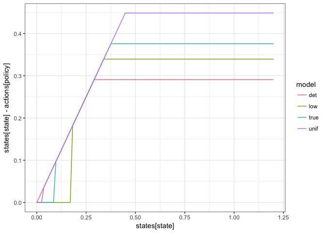
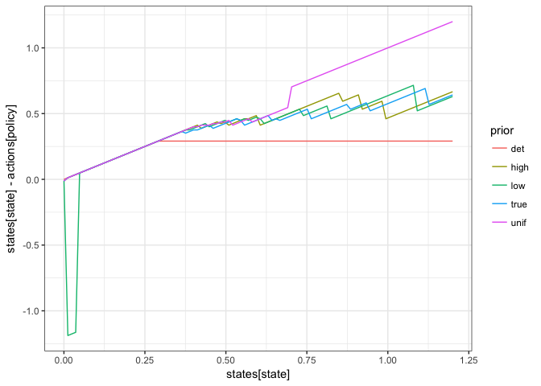
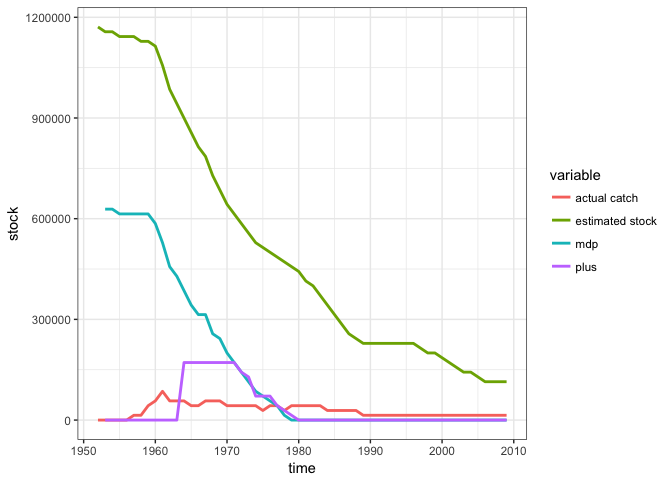
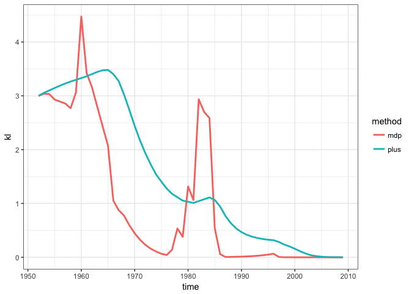

# Setup


```r
library("mdplearning")
library("appl")
library("pomdpplus")
library("tidyverse")
library("seewave") ## For KL divergence only

knitr::opts_chunk$set(cache = FALSE, message=FALSE)
theme_set(theme_bw())
```

Identify available solutions in the log that match the desired parameters


```r
log_dir <- "https://raw.githubusercontent.com/cboettig/pomdp-solutions-library/master/tuna-50"
meta <- appl::meta_from_log(data.frame(model ="ricker", sigma_m = 0.3), log_dir) %>% arrange(r)
```

```
## Warning: failed to assign NativeSymbolInfo for env since env is already
## defined in the 'lazyeval' namespace
```

```r
meta
```

```
##            id load_time_sec init_time_sec run_time_sec final_precision
## 1 2ff6d2cc3ab          0.59         72.83        72.84    -2.99524e-07
## 2 2fe6d2cc3ab          0.67        114.97     51772.70     3.31746e-02
## 3 31329c2d3ef          0.61        117.40     51001.60     1.42153e-02
## 4 31229c2d3ef          0.66        129.19     51169.00     3.20650e-02
## 5 31129c2d3ef          0.56        120.72     51068.70     3.74855e-02
## 6 31029c2d3ef          0.70        138.83     51417.40     7.82105e-02
## 7 30f29c2d3ef          0.65        127.39     51286.50     2.14102e-02
## 8 30e29c2d3ef          0.59        126.75     51904.50     2.99960e-02
##                end_condition n_states n_obs n_actions discount
## 1   target precision reached       50    50        50     0.99
## 2     Preset timeout reached       50    50        50     0.99
## 3     Preset timeout reached       50    50        50     0.99
## 4     Preset timeout reached       50    50        50     0.99
## 5     Preset timeout reached       50    50        50     0.99
## 6     Preset timeout reached       50    50        50     0.99
## 7     Preset timeout reached       50    50        50     0.99
## 8     Preset timeout reached       50    50        50     0.99
##                  date     r sigma_m         K  C    sigma_g discount.1
## 1 2016-12-31 21:44:41 0.025     0.3 0.9903371 NA 0.01720091       0.99
## 2 2017-01-01 11:14:53 0.050     0.3 0.9903371 NA 0.01720091       0.99
## 3 2016-12-31 21:01:47 0.075     0.3 0.9903371 NA 0.01720091       0.99
## 4 2016-12-31 21:04:34 0.100     0.3 0.9903371 NA 0.01720091       0.99
## 5 2016-12-31 21:02:53 0.125     0.3 0.9903371 NA 0.01720091       0.99
## 6 2016-12-31 21:08:41 0.150     0.3 0.9903371 NA 0.01720091       0.99
## 7 2016-12-31 21:06:31 0.175     0.3 0.9903371 NA 0.01720091       0.99
## 8 2016-12-31 21:16:51 0.200     0.3 0.9903371 NA 0.01720091       0.99
##    model precision  memory timeout timeInterval max_state max_obs
## 1 ricker     1e-12 5344949   50000         5000       1.2     1.2
## 2 ricker     1e-12 5344949   50000         5000       1.2     1.2
## 3 ricker     1e-12 5344949   50000         5000       1.2     1.2
## 4 ricker     1e-12 5344949   50000         5000       1.2     1.2
## 5 ricker     1e-12 5344949   50000         5000       1.2     1.2
## 6 ricker     1e-12 5344949   50000         5000       1.2     1.2
## 7 ricker     1e-12 5344949   50000         5000       1.2     1.2
## 8 ricker     1e-12 5344949   50000         5000       1.2     1.2
##   max_action min_state min_obs min_action
## 1        1.2         0       0          0
## 2        1.2         0       0          0
## 3        1.2         0       0          0
## 4        1.2         0       0          0
## 5        1.2         0       0          0
## 6        1.2         0       0          0
## 7        1.2         0       0          0
## 8        1.2         0       0          0
```

Read in the POMDP problem specification from the log


```r
true_i <- 2

setup <- meta[1,]
states <- seq(0, setup$max_state, length=setup$n_states) # Vector of all possible states
actions <- states
obs <- states
sigma_g <- setup$sigma_g
sigma_m <- setup$sigma_m
reward_fn <- function(x,h) pmin(x,h)
discount <- setup$discount 
models <- models_from_log(meta, reward_fn)  ## Not valid for non-uniform
```


```r
alphas <- alphas_from_log(meta, log_dir)
```


reformat model solutions for use by the MDP functions as well:


```r
transitions <- lapply(models, `[[`, "transition")
reward <- models[[1]]$reward
observation <- models[[1]]$observation
```

--------------------

# Verfication & Validation


Compute the deterministic optimum solution:


```r
f <- f_from_log(meta)[[1]]
S_star <- optimize(function(x) x / discount - f(x,0), c(min(states),max(states)))$minimum
h <- pmax(states - S_star,  0)
policy <- sapply(h, function(h) which.min((abs(h - actions))))
det <- data.frame(policy, value = 1:length(states), state = 1:length(states))
```


## Convergence testing

(only evaluate if log has intermediate policies)


```r
inter <- appl:::intermediates_from_log(meta, log_dir = log_dir)

if(length(inter[[1]]) > 0){
df1 <- 
purrr::map_df(1:length(models), function(j){
  alphas <- inter[[j]]
  m <- models[[j]]
  purrr::map_df(1:length(alphas), function(i)
    compute_policy(alphas[[i]], m$transition, m$observation, m$reward),
    .id = "intermediate") 
}, .id = "model_id")

df1 %>% 
  ggplot(aes(states[state], states[state] - actions[policy], col=intermediate)) + 
  geom_line() + 
  facet_wrap(~model_id, scales = "free") + 
  coord_cartesian(ylim = c(0,0.5))
}
```


## Examine MDP


```r
unif <- mdp_compute_policy(transitions, reward, discount)
prior <- numeric(length(models))
prior[1] <- 1
low <- mdp_compute_policy(transitions, reward, discount, prior)
prior <- numeric(length(models))
prior[true_i] <- 1
true <- mdp_compute_policy(transitions, reward, discount, prior)

bind_rows(unif = unif, low = low, true = true, det = det, .id = "model") %>%
  ggplot(aes(states[state], states[state] - actions[policy], col = model)) + geom_line()
```

<!-- -->


## Examine the policies from POMDP/PLUS solutions


Compare a uniform prior to individial cases:


```r
prior <- numeric(length(models))
prior[1] <- 1
low <-  compute_plus_policy(alphas, models, prior)
prior <- numeric(length(models))
prior[true_i] <- 1
true <-  compute_plus_policy(alphas, models, prior)
unif <- compute_plus_policy(alphas, models) # e.g. 'planning only'
prior <- numeric(length(models))
prior[length(prior)] <- 1
high <-  compute_plus_policy(alphas, models, prior)
df <- dplyr::bind_rows(low = low, true=true, unif = unif, high = high, det = det, .id = "prior")

ggplot(df, aes(states[state], states[state] - actions[policy], col = prior, pch = prior)) + 
#  geom_point(alpha = 0.5, size = 3) + 
  geom_line()
```

<!-- -->


------------

# Analysis

## Hindcast 

Historical catch and stock


```r
set.seed(123)
data("scaled_data")
y <- sapply(scaled_data$y, function(y) which.min(abs(states - y)))
a <- sapply(scaled_data$a, function(a) which.min(abs(actions - a)))
Tmax <- length(y)

data("bluefin_tuna")
to_mt <- max(bluefin_tuna$total) # 1178363 # scaling factor for data
states_mt <- to_mt * states
actions_mt <- to_mt * actions
year <- 1952:2009
future <- 2009:2067
```


```r
plus_hindcast <- compare_plus(models = models, discount = discount,
                    obs = y, action = a, alphas = alphas)
```


```r
mdp_hindcast <- mdp_historical(transitions, reward, discount, state = y, action = a)
```


```r
left_join(rename(plus_hindcast$df, plus = optimal, state = obs),  
          rename(mdp_hindcast$df, mdp = optimal)) %>%
mutate("actual catch" = actions_mt[action], "estimated stock" = states_mt[state], 
       plus = actions_mt[plus], mdp = actions_mt[mdp], time = year[time]) %>%
       select(-state, -action) %>%
gather(variable, stock, -time) %>% 
ggplot(aes(time, stock, color = variable)) + geom_line(lwd=1) #  + geom_point()
```

```
## Warning: Removed 2 rows containing missing values (geom_path).
```

<!-- -->

## Compare rates of learning


```r
# delta function for true model distribution
h_star = array(0,dim = length(models)) 
h_star[2] = 1
## Fn for the base-2 KL divergence from true model, in a friendly format
kl2 <- function(value) seewave::kl.dist(value, h_star, base = 2)[[2]]

bind_rows(plus = plus_hindcast$model_posterior,
          mdp = mdp_hindcast$posterior, 
          .id = "method") %>%
mutate(time = year[rep(1:Tmax,2)], rep = 1) %>%
gather(model, value, -time, -rep, -method) %>%
group_by(time, rep, method) %>% 
summarise(kl = kl2(value)) %>%

ggplot(aes(time, kl, col = method)) + 
stat_summary(geom="line", fun.y = mean, lwd = 1)
```

<!-- -->

### Final beliefs

Show the final belief over models for pomdp and mdp:


```r
barplot(as.numeric(plus_hindcast$model_posterior[Tmax,]))
```

<!-- -->


```r
barplot(as.numeric(mdp_hindcast$posterior[Tmax,]))
```

<!-- -->


## Forecast simulations under PLUS and MDP-learning

All forecasts start from final stock, go forward an equal length of time:


```r
x0 <- y[length(y)] # Final stock, 
Tmax <- length(y)
set.seed(123)
```

Note also that forecasts start with the prior belief over states and prior belief over models that was determined from the historical data.  


```r
plus_forecast <- 
plus_replicate(40, 
               sim_plus(models = models, discount = discount,
                        model_prior = as.numeric(plus_hindcast$model_posterior[length(y), ]),
                        state_prior = as.numeric(plus_hindcast$state_posterior[length(y), ]),
                        x0 = x0, Tmax = Tmax, true_model = models[[true_i]], alphas = alphas), 
               mc.cores = parallel::detectCores())
```

We simulate replicates under MDP learning (with observation uncertainty):


```r
set.seed(123)
mdp_forecast <- 
plus_replicate(40, 
               mdp_learning(transition = transitions, reward = models[[true_i]]$reward, 
                            model_prior = as.numeric(mdp_hindcast$posterior[length(y),]),
                            discount = discount, x0 = x0,  Tmax = Tmax,
                            true_transition = transitions[[true_i]], 
                            observation = models[[true_i]]$observation),
               mc.cores = parallel::detectCores())
```

## Compare forecasts


```r
historical <- bluefin_tuna[c("tsyear", "total", "catch_landings")] %>% 
  rename(time = tsyear, state = total, action = catch_landings) %>% 
  mutate(method = "historical")

bind_rows(plus = plus_forecast$df, 
          mdp = mdp_forecast$df,
          .id = "method")  %>% 
select(-value, -obs) %>% 
mutate(state = states_mt[state], action = actions_mt[action], time = future[time]) %>% 
bind_rows(historical) %>%
rename("catch (MT)" = action, "stock (MT)" = state) %>%  
gather(variable, stock, -time, -rep, -method) %>%
ggplot(aes(time, stock)) + 
  geom_line(aes(group = interaction(rep,method), color = method), alpha=0.2) +
  stat_summary(aes(color = method), geom="line", fun.y = mean, lwd=1) +
  stat_summary(aes(fill = method), geom="ribbon", fun.data = mean_sdl, fun.args = list(mult=1), alpha = 0.25) + 
  facet_wrap(~variable, ncol = 1, scales = "free_y")
```

<!-- -->


