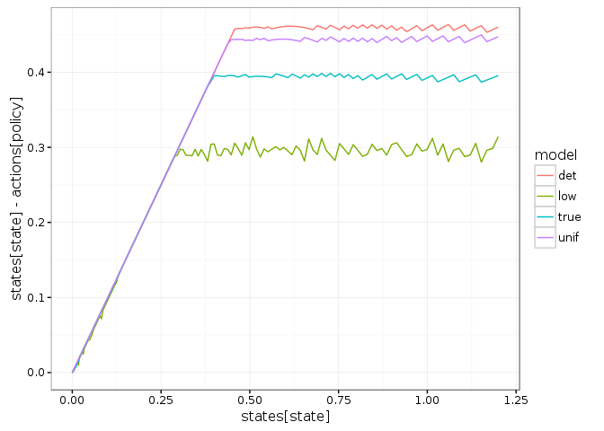
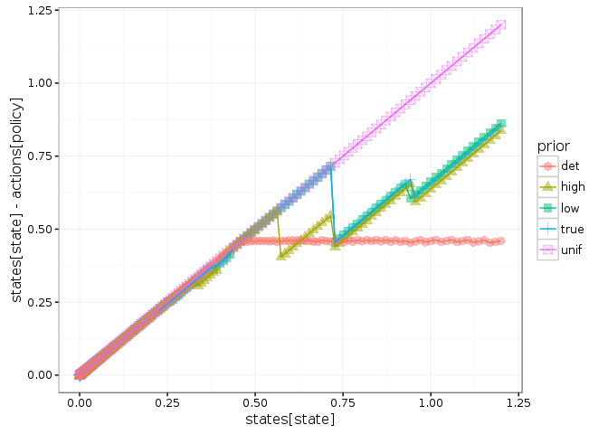
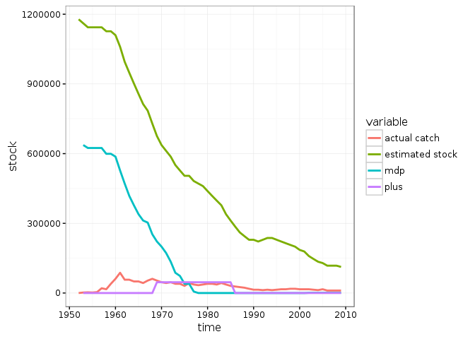
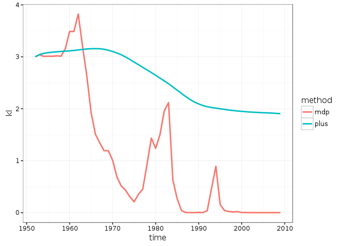
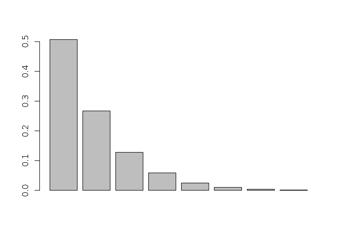
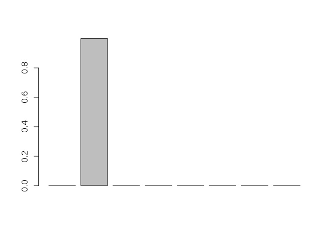
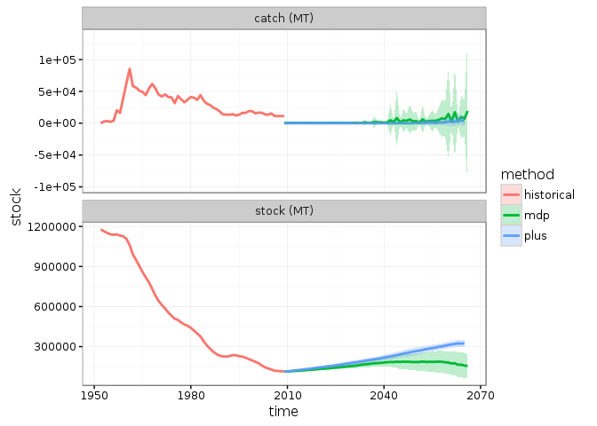

# Setup


```r
library("mdplearning")
library("appl")
library("pomdpplus")

library("ggplot2")
library("tidyr")
library("purrr")
library("dplyr")

library("seewave") ## For KL divergence only

knitr::opts_chunk$set(cache = TRUE, message=FALSE)
theme_set(theme_bw())
```

(Scaled data created from RAM data via script in `mdplearning/data-raw/scaled_data.R`)


```r
library("nimble")
data("scaled_data")
ricker_code <- nimbleCode({
  x[1] <- x0
  for(t in 1:(N-1)){
    s[t] <-  x[t] - min(x[t], a[t])
    mu[t] <- log(s[t])  + r * (1 - s[t] / K) 
    x[t+1] ~ dlnorm(mu[t], sd = sigma) 
  }
})

ricker_model <- nimbleModel(code = ricker_code, 
                            constants = list(N = length(scaled_data$a), a = scaled_data$a),
                            inits =  list(K = 1, r = 0.1, sigma = 0.1, x0 = scaled_data$y[1]), 
                            data = data.frame(x = scaled_data$y))

mloglik <- function(pars){
    if(any(pars < 0 )) return(1e12)
    ricker_model$r <- pars[1]
    ricker_model$K <- pars[2]
    ricker_model$sigma <- pars[3]
    - calculate(ricker_model)
}

ricker_fit <- optim(c(r = .1, K = 1, sigma = 0.1), mloglik, control = list(maxit = 20000))
ricker_fit$par
```


## Problem definition

(Code to create the logged alpha vectors; cached & not evaluated, very slow)


```r
mc.cores = 1
log_dir = "."
p <- 2
states <- seq(0, 1.2^(1/p), len=150)^p # Vector of all possible states
actions <- states  # Vector of actions: harvest
obs <- states
K = 0.9903371
r = 0.05699246
sigma_g = 0.01720091
discount = 0.99

#vars <- expand.grid(r = rev(seq(0.025, 0.2, by =0.025)), sigma_m = c(0.2, 0.4, 0.6))
vars <- expand.grid(r = seq(0.025, 0.2, by =0.025), sigma_m = 0.4)


## Detect available memory (linux servers only)
memory <- round(0.95 * as.numeric(gsub(".* (\\d+) .*", "\\1", system("cat /proc/meminfo", intern=TRUE)[1])))
## Bind this to a data.frame listing each of the fixed parameters across all runs
fixed <- data.frame( K = K, C = NA, sigma_g = sigma_g, discount = discount, model = "ricker", 
                     precision = 0.0000001, memory = memory / mc.cores, timeout = 20000, timeInterval = 100,
                     max_state = max(states), max_obs = max(obs), max_action = max(actions), 
                     min_state = min(states), min_obs = min(obs), min_action = min(actions),
                     states_code = "seq(0, 1.2^(1/p), len=100)^p")
pars <- data.frame(vars, fixed)
## Usual assumption at the moment for reward fn
reward_fn <- function(x,h) pmin(x,h)
## Compute alphas for the above examples
models <- lapply(1:dim(pars)[1], function(i){
  ## Select the model
  f <- switch(pars[i, "model"], 
              allen = appl:::allen(pars[i, "r"], pars[i, "K"], pars[i, "C"]),
              ricker = appl:::ricker(pars[i, "r"], pars[i, "K"])
  )
  ## Compute matrices
  fisheries_matrices(states, actions, obs, 
                     reward_fn, f = f, 
                     sigma_g = pars[i, "sigma_g"], 
                     sigma_m  = pars[i, "sigma_m"])
})
```


```r
alphas <- sarsop_plus(models, 
                      discount = pars[1, "discount"], 
                      precision = pars[1, "precision"], 
                      timeout = pars[1, "timeout"],
                      timeInterval = pars[1, "timeInterval"],
                      log_dir = log_dir, 
                      log_data = pars,
                      mc.cores = mc.cores)
```

Identify available solutions in the log that match the desired parameters


```r
log_dir <- "https://raw.githubusercontent.com/cboettig/pomdp-solutions-library/master/tacc-44"
meta <- appl::meta_from_log(data.frame(model ="ricker", sigma_m = 0.4), log_dir)


## 50 states, 60 GB solution
#meta <- appl::meta_from_log(data.frame(model ="ricker", n_states = 50, sigma_m = 0.3), log_dir)
#meta <- data.frame(meta, max_state = 1.2, max_obs = 1.2, max_action = 0.8)
meta
```

```
##                                      id load_time_sec init_time_sec
## 9  16aaa8ae-cf31-403d-96c7-761d9a08355a         14.88       4939.78
## 10 60240bd0-65f2-4f39-a999-52a9cec198ec         15.10       5032.40
## 11 5ba2dae4-e8bc-47b9-82c5-29a0c171189e         15.14       4592.73
## 12 d15e1bb8-8567-4aad-8284-b2cdf76f2c97         13.89       4716.04
## 13 32703956-328f-479a-b48f-4963a9907ff4         14.37       4255.42
## 14 e4426242-c55a-4ff3-a74c-9ed37c8710e6         15.56       3969.21
## 15 36c4535c-ade5-493b-806d-27bb07c0a4d8         15.35       3168.10
## 16 cf5738ca-7d8b-4e38-a6e3-0252f882c73b         14.80       3806.00
##    run_time_sec final_precision            end_condition n_states n_obs
## 9       20531.5       0.1052120   Preset timeout reached      150   150
## 10      20250.6       0.0919504   Preset timeout reached      150   150
## 11      20375.0       0.0602637   Preset timeout reached      150   150
## 12      21401.2       0.0746996   Preset timeout reached      150   150
## 13      20393.5       0.0447117   Preset timeout reached      150   150
## 14      20276.2       0.0328067   Preset timeout reached      150   150
## 15      20136.7       0.0102382   Preset timeout reached      150   150
## 16      20594.6       0.0199770   Preset timeout reached      150   150
##    n_actions discount                date     r sigma_m         K  C
## 9        150     0.99 2016-09-24 14:28:16 0.200     0.4 0.9903371 NA
## 10       150     0.99 2016-09-24 14:39:08 0.175     0.4 0.9903371 NA
## 11       150     0.99 2016-09-24 14:46:25 0.125     0.4 0.9903371 NA
## 12       150     0.99 2016-09-24 14:46:59 0.150     0.4 0.9903371 NA
## 13       150     0.99 2016-09-24 21:08:02 0.100     0.4 0.9903371 NA
## 14       150     0.99 2016-09-24 21:16:10 0.075     0.4 0.9903371 NA
## 15       150     0.99 2016-09-24 21:16:51 0.025     0.4 0.9903371 NA
## 16       150     0.99 2016-09-24 21:29:17 0.050     0.4 0.9903371 NA
##       sigma_g discount.1  model precision  memory timeout timeInterval
## 9  0.01720091       0.99 ricker     1e-07 9799086   20000          100
## 10 0.01720091       0.99 ricker     1e-07 9799086   20000          100
## 11 0.01720091       0.99 ricker     1e-07 9799086   20000          100
## 12 0.01720091       0.99 ricker     1e-07 9799086   20000          100
## 13 0.01720091       0.99 ricker     1e-07 9799086   20000          100
## 14 0.01720091       0.99 ricker     1e-07 9799086   20000          100
## 15 0.01720091       0.99 ricker     1e-07 9799086   20000          100
## 16 0.01720091       0.99 ricker     1e-07 9799086   20000          100
##    max_state max_obs max_action min_state min_obs min_action
## 9        1.2     1.2        1.2         0       0          0
## 10       1.2     1.2        1.2         0       0          0
## 11       1.2     1.2        1.2         0       0          0
## 12       1.2     1.2        1.2         0       0          0
## 13       1.2     1.2        1.2         0       0          0
## 14       1.2     1.2        1.2         0       0          0
## 15       1.2     1.2        1.2         0       0          0
## 16       1.2     1.2        1.2         0       0          0
```

```r
#knitr::kable(meta)
```

Read in the POMDP problem specification from the log


```r
## Not read from log in this case, since only applies for uniform grids 
#setup <- meta[1,]
#p <- 2
#states <- seq(0, 1.2^(1/p), len=setup$n_states)^p #
#states <- seq(0, setup$max_state, length=setup$n_states) # Vector of all possible states
#actions <- states
#obs <- states
#sigma_g <- setup$sigma_g
#sigma_m <- setup$sigma_m
#reward_fn <- function(x,h) pmin(x,h)
#discount <- setup$discount 
# models <- models_from_log(meta, reward_fn)  ## Not valid for non-uniform
```


```r
alphas <- alphas_from_log(meta, log_dir)
```


reformat model solutions for use by the MDP functions as well:


```r
transitions <- lapply(models, `[[`, "transition")
reward <- models[[1]]$reward
observation <- models[[1]]$observation
```

--------------------

# Verfication & Validation


Compute the deterministic optimum solution:


```r
f <- f_from_log(meta)[[1]]
S_star <- optimize(function(x) x / discount - f(x,0), c(min(states),max(states)))$minimum
h <- pmax(states - S_star,  0)
policy <- sapply(h, function(h) which.min((abs(h - actions))))
det <- data.frame(policy, value = 1:length(states), state = 1:length(states))
```


## Examine MDP


```r
unif <- mdp_compute_policy(transitions, reward, discount)
prior <- numeric(length(models))
prior[1] <- 1
low <- mdp_compute_policy(transitions, reward, discount, prior)
prior <- numeric(length(models))
prior[2] <- 1
true <- mdp_compute_policy(transitions, reward, discount, prior)

bind_rows(unif = unif, low = low, true = true, det = det, .id = "model") %>%
  ggplot(aes(states[state], states[state] - actions[policy], col = model)) + geom_line()
```

<!-- -->


## Examine the policies from POMDP/PLUS solutions


Compare a uniform prior to individial cases:


```r
prior <- numeric(length(models))
prior[1] <- 1
low <-  compute_plus_policy(alphas, models, prior)
prior <- numeric(length(models))
prior[2] <- 1
true <-  compute_plus_policy(alphas, models, prior)
unif <- compute_plus_policy(alphas, models) # e.g. 'planning only'
prior <- numeric(length(models))
prior[length(prior)] <- 1
high <-  compute_plus_policy(alphas, models, prior)
df <- dplyr::bind_rows(low = low, true=true, unif = unif, high = high, det = det, .id = "prior")

ggplot(df, aes(states[state], states[state] - actions[policy], col = prior, pch = prior)) + 
  geom_point(alpha = 0.5, size = 3) + 
  geom_line()
```

<!-- -->


------------

# Analysis

## Hindcast 

Historical catch and stock


```r
set.seed(123)
data("scaled_data")
y <- sapply(scaled_data$y, function(y) which.min(abs(states - y)))
a <- sapply(scaled_data$a, function(a) which.min(abs(actions - a)))
Tmax <- length(y)

data("bluefin_tuna")
to_mt <- max(bluefin_tuna$total) # 1178363 # scaling factor for data
states_mt <- to_mt * states
actions_mt <- to_mt * actions
year <- 1952:2009
future <- 2009:2067
```


```r
plus_hindcast <- compare_plus(models = models, discount = discount,
                    obs = y, action = a, alphas = alphas)
```


```r
mdp_hindcast <- mdp_historical(transitions, reward, discount, state = y, action = a)
```


```r
left_join(rename(plus_hindcast$df, plus = optimal, state = obs),  
          rename(mdp_hindcast$df, mdp = optimal)) %>%
mutate("actual catch" = actions_mt[action], "estimated stock" = states_mt[state], 
       plus = actions_mt[plus], mdp = actions_mt[mdp], time = year[time]) %>%
       select(-state, -action) %>%
gather(variable, stock, -time) %>% 
ggplot(aes(time, stock, color = variable)) + geom_line(lwd=1) #  + geom_point()
```

```
## Warning: failed to assign NativeSymbolInfo for env since env is already
## defined in the 'lazyeval' namespace
```

```
## Warning: Removed 2 rows containing missing values (geom_path).
```

<!-- -->

## Compare rates of learning


```r
# delta function for true model distribution
h_star = array(0,dim = length(models)) 
h_star[2] = 1
## Fn for the base-2 KL divergence from true model, in a friendly format
kl2 <- function(value) seewave::kl.dist(value, h_star, base = 2)[[2]]

bind_rows(plus = plus_hindcast$model_posterior,
          mdp = mdp_hindcast$posterior, 
          .id = "method") %>%
mutate(time = year[rep(1:Tmax,2)], rep = 1) %>%
gather(model, value, -time, -rep, -method) %>%
group_by(time, rep, method) %>% 
summarise(kl = kl2(value)) %>%

ggplot(aes(time, kl, col = method)) + 
stat_summary(geom="line", fun.y = mean, lwd = 1)
```

<!-- -->

### Final beliefs

Show the final belief over models for pomdp and mdp:


```r
barplot(as.numeric(plus_hindcast$model_posterior[Tmax,]))
```

<!-- -->


```r
barplot(as.numeric(mdp_hindcast$posterior[Tmax,]))
```

<!-- -->


## Forecast simulations under PLUS and MDP-learning

All forecasts start from final stock, go forward an equal length of time:


```r
x0 <- y[length(y)] # Final stock, 
Tmax <- length(y)
set.seed(123)
```

Note also that forecasts start with the prior belief over states and prior belief over models that was determined from the historical data.  


```r
plus_forecast <- 
plus_replicate(50, 
               sim_plus(models = models, discount = discount,
                        model_prior = as.numeric(plus_hindcast$model_posterior[length(y), ]),
                        state_prior = as.numeric(plus_hindcast$state_posterior[length(y), ]),
                        x0 = x0, Tmax = Tmax, true_model = models[[1]], alphas = alphas), 
               mc.cores = parallel::detectCores())
```

We simulate replicates under MDP learning (with observation uncertainty):


```r
set.seed(123)
mdp_forecast <- 
plus_replicate(50, 
               mdp_learning(transition = transitions, reward = models[[1]]$reward, 
                            model_prior = as.numeric(mdp_hindcast$posterior[length(y),]),
                            discount = discount, x0 = x0,  Tmax = Tmax,
                            true_transition = transitions[[1]], 
                            observation = models[[1]]$observation),
               mc.cores = parallel::detectCores())
```

## Compare forecasts


```r
historical <- bluefin_tuna[c("tsyear", "total", "catch_landings")] %>% 
  rename(time = tsyear, state = total, action = catch_landings) %>% 
  mutate(method = "historical")
```

```
## Warning: failed to assign NativeSymbolInfo for env since env is already
## defined in the 'lazyeval' namespace
```

```r
bind_rows(plus = plus_forecast$df, 
          mdp = mdp_forecast$df,
          .id = "method")  %>% 
select(-value, -obs) %>% 
mutate(state = states_mt[state], action = actions_mt[action], time = future[time]) %>% 
bind_rows(historical) %>%
rename("catch (MT)" = action, "stock (MT)" = state) %>%  
gather(variable, stock, -time, -rep, -method) %>%
ggplot(aes(time, stock)) + 
  #geom_line(aes(group = interaction(rep,method), color = method), alpha=0.2) +
  stat_summary(aes(color = method), geom="line", fun.y = mean, lwd=1) +
  stat_summary(aes(fill = method), geom="ribbon", fun.data = mean_sdl, fun.args = list(mult=1), alpha = 0.25) + 
  facet_wrap(~variable, ncol = 1, scales = "free_y")
```

<!-- -->


